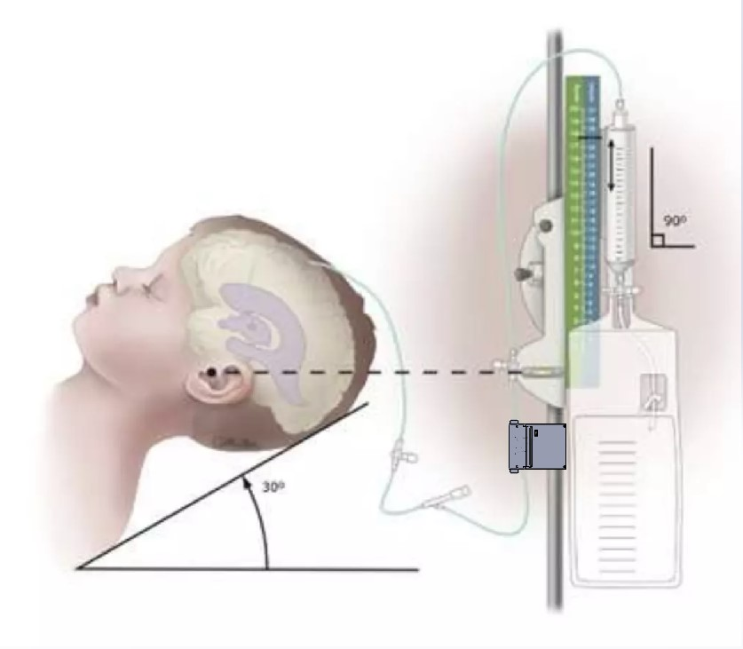

There is a lack of consensus amongst medical professionals for how patients
requiring implanted external ventricular drains (EVD) should be managed. Each
year, EVDs are used as lifesaving devices for over 25,000 U.S. ICU patients,
most with hemorrhagic stroke or TBI. There exists significant
cross-institutional variation in how EVDs are managed once implanted, including
criteria for weaning or removal.

Routine EVD management, including weaning and clamp trials, is currently a
labor-intensive process directed by neurosurgeons and/or critical care
neurologists. Bedside nurses strive to maintain a constant EVD height for
passive drainage, while manually measuring pressure hourly using a sensor
requiring intermittent drain clamping. Physicians are notified if pressure
exceeds threshold or if the EVD becomes disconnected or occluded. Additionally,
routine observations are recorded, such as hourly neurological assessment,
output volume, exudate color, and appearance.

Clinicians rely on a subjective, holistic review of both quantitative measures
(such as volumetric output and pressure trends) and qualitative measures (color
of exudate, turbidity, clinical exam) that is judged once daily on rounds,
depending on their training and institutional practice patterns. There is a
paucity of evidence-based standards, with no technology providing real-time
quantification of all these variables.

Efficiency of EVD management is a key goal: EVD left implanted unnecessarily
long leads to increased ICU costs and higher cumulative risk of ventriculitis, a
deadly infection with >30% mortality. Conversely, weaning too early can lead to
re-implantation of the drain and increased ICU length of stay, with its
attendant costs and risks.

**Ventrisense seeks to bring EVD management into the 21st century by using real-time passive data collection to transform a subjective “art” into a quantitative science. Our device will non-invasively monitor exudate composition and flow with optical technology in high time-resolution, thereby providing sophisticated quantitative measures to guide clinical decisions. Ultimately, this enables simultaneous drainage and pressure estimation in real-time, at no additional risk to patients.**